# gRPC Microservices Architecture with Distributed Tracing

## Executive Summary

This document describes an architectural design for a polyglot microservices system communicating via gRPC, with comprehensive distributed tracing, metrics collection, and centralized observability. The design leverages industry-standard OpenTelemetry for instrumentation and exports telemetry data via OTLP over gRPC for optimal performance and consistency with the service communication protocol.

---

## Table of Contents

1. [Requirements](#requirements)
2. [Architecture Overview](#architecture-overview)
3. [Core Components](#core-components)
4. [Distributed Tracing Design](#distributed-tracing-design)
5. [Metrics Collection](#metrics-collection)
6. [Logging Strategy](#logging-strategy)
7. [Language-Specific Implementations](#language-specific-implementations)
8. [Deployment Architecture](#deployment-architecture)
9. [Alternative Designs Considered](#alternative-designs-considered)
10. [Security Considerations](#security-considerations)
11. [Implementation Roadmap](#implementation-roadmap)

---

## Requirements

### Functional Requirements
- Microservices communicate via gRPC
- End-to-end request tracing across service boundaries
- Centralized collection of traces, metrics, and logs
- Support for Go, Rust, Python, and C implementations

### Non-Functional Requirements
- Industry-standard, battle-tested solutions only
- Minimal performance overhead (<5% latency impact)
- Language-idiomatic implementations
- Unified protocol stack (gRPC for both service and telemetry traffic)

---

## Architecture Overview

### High-Level System Architecture

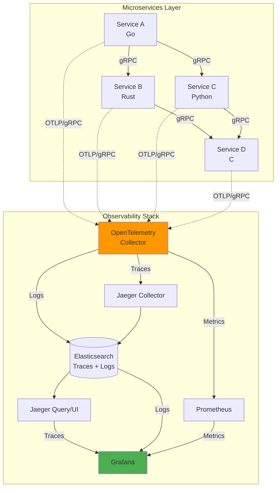

### Data Flow Architecture

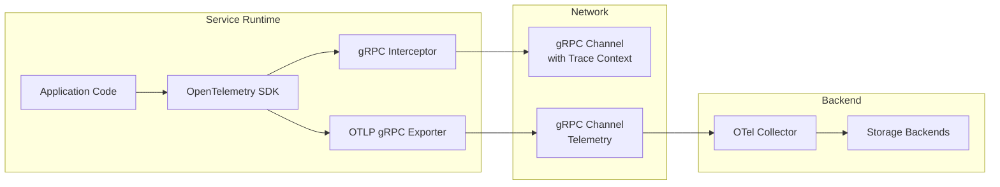

---

## Core Components

### 1. OpenTelemetry (OTEL)

OpenTelemetry is the CNCF-graduated standard for observability instrumentation. It provides:

- **Unified API**: Single API for traces, metrics, and logs
- **Auto-instrumentation**: Automatic gRPC interceptors
- **Context Propagation**: W3C Trace Context standard
- **Multiple Exporters**: OTLP, Jaeger, Zipkin, Prometheus

### 2. Telemetry Transport Protocol

**Selected: OTLP over gRPC**

Using gRPC for telemetry transport provides consistency with service-to-service communication, efficient binary encoding via protobuf, and support for streaming which is ideal for high-volume telemetry data.

| Protocol | Transport | Pros | Cons |
|----------|-----------|------|------|
| OTLP/gRPC | gRPC | Efficient, streaming, consistent protocol stack, bidirectional | Requires HTTP/2 support |
| OTLP/HTTP | HTTP/1.1 or HTTP/2 | Wide support, simpler debugging | Slightly higher overhead |
| Jaeger Thrift | HTTP/UDP | Legacy support | Deprecated in favor of OTLP |
| Zipkin | HTTP/JSON | Simple | Limited features |

### 3. Observability Backend Stack

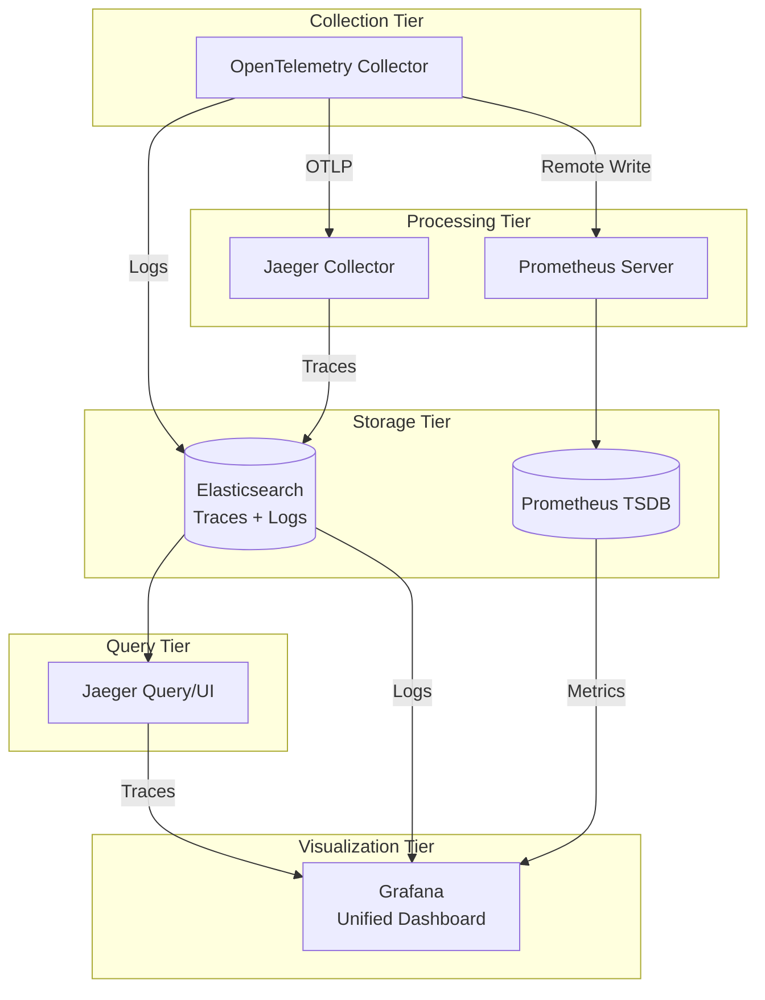

---

## Distributed Tracing Design

### Trace Context Propagation

All services propagate trace context using the W3C Trace Context standard via gRPC metadata headers:

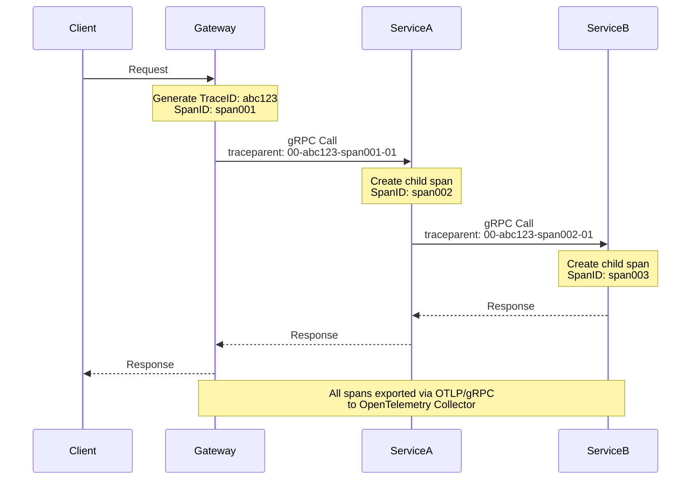

### Trace Structure

```mermaid
gantt
    title Distributed Trace Timeline
    dateFormat X
    axisFormat %L ms

    section Gateway
    HTTP Request Processing    :a1, 0, 150

    section Service A (Go)
    gRPC Handler              :a2, 10, 100
    Database Query            :a3, 30, 50

    section Service B (Rust)
    gRPC Handler              :a4, 50, 80
    External API Call         :a5, 55, 70

    section Service C (Python)
    gRPC Handler              :a6, 60, 90
    ML Inference              :a7, 65, 85
```

### Span Attributes Standard

All services must include these standard attributes:

| Attribute | Description | Example |
|-----------|-------------|---------|
| `service.name` | Service identifier | `user-service` |
| `service.version` | Deployment version | `1.2.3` |
| `service.instance.id` | Instance identifier | `pod-abc123` |
| `rpc.system` | RPC system | `grpc` |
| `rpc.service` | gRPC service name | `UserService` |
| `rpc.method` | gRPC method | `GetUser` |
| `rpc.grpc.status_code` | gRPC status | `0` (OK) |

---

## Metrics Collection

### Metrics Architecture

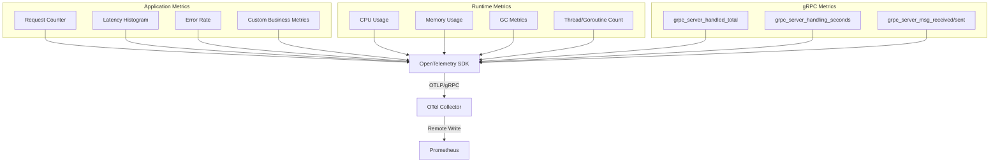

### Standard Metrics

#### RED Metrics (Request, Error, Duration)
```
# Request rate
grpc_server_handled_total{grpc_service, grpc_method, grpc_code}

# Error rate
grpc_server_handled_total{grpc_code!="OK"} / grpc_server_handled_total

# Duration
grpc_server_handling_seconds_bucket{grpc_service, grpc_method}
```

#### USE Metrics (Utilization, Saturation, Errors)
```
# CPU utilization
process_cpu_seconds_total

# Memory utilization
process_resident_memory_bytes

# Connection saturation
grpc_server_started_total - grpc_server_handled_total
```

---

## Logging Strategy

### Structured Logging with Trace Correlation

All logs must include trace context for correlation:

```json
{
  "timestamp": "2024-01-15T10:30:00.000Z",
  "level": "INFO",
  "message": "Processing user request",
  "trace_id": "abc123def456",
  "span_id": "span789",
  "service": "user-service",
  "attributes": {
    "user_id": "12345",
    "action": "get_profile"
  }
}
```

### Log Flow Architecture

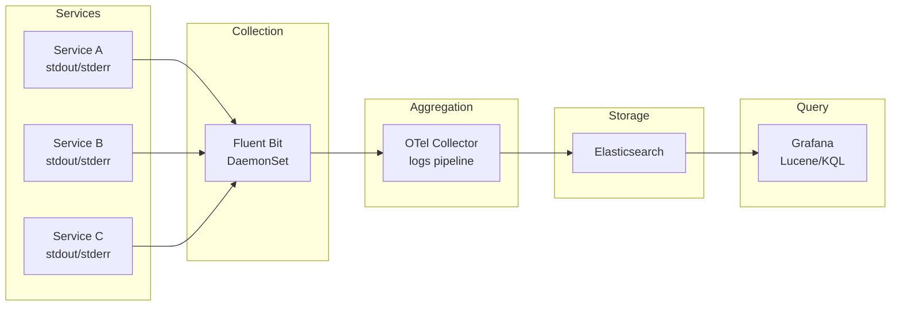

---

## Language-Specific Implementations

### Go Implementation

Go has first-class OpenTelemetry support with idiomatic patterns.

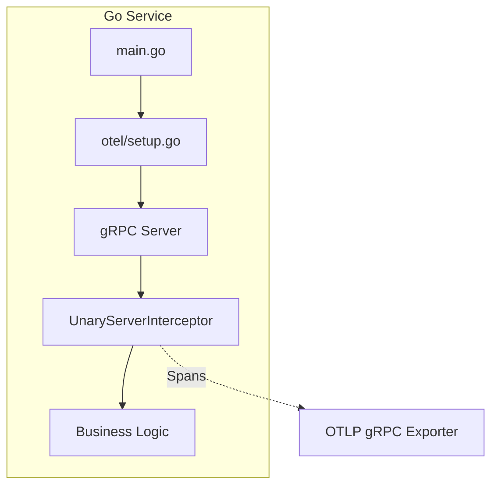

**Key Libraries:**
- `go.opentelemetry.io/otel`
- `go.opentelemetry.io/otel/exporters/otlp/otlptrace/otlptracegrpc`
- `go.opentelemetry.io/contrib/instrumentation/google.golang.org/grpc/otelgrpc`

**Idiomatic Pattern:**
```go
// Interceptor automatically creates spans for gRPC calls
grpc.NewServer(
    grpc.StatsHandler(otelgrpc.NewServerHandler()),
)
```

### Rust Implementation

Rust uses the `opentelemetry` crate ecosystem with `tonic` for gRPC.

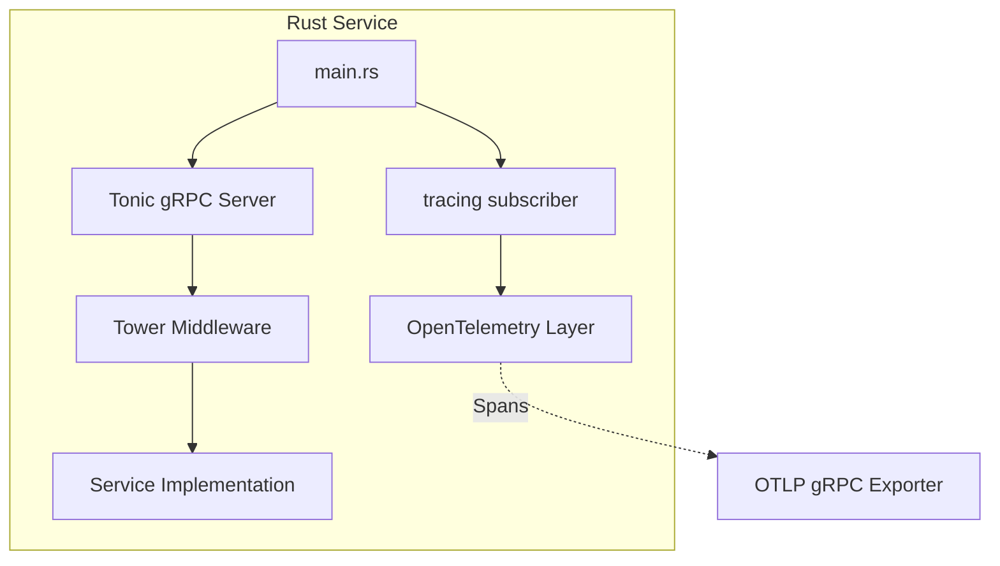

**Key Crates:**
- `opentelemetry`
- `opentelemetry-otlp` (with `grpc-tonic` feature)
- `tracing-opentelemetry`
- `tonic`

**Idiomatic Pattern:**
```rust
// Using tracing macros with OpenTelemetry layer
#[tracing::instrument]
async fn handle_request(&self, request: Request<T>) -> Result<Response<R>, Status> {
    // Automatically creates spans
}
```

### Python Implementation

Python uses `opentelemetry-python` with automatic instrumentation.

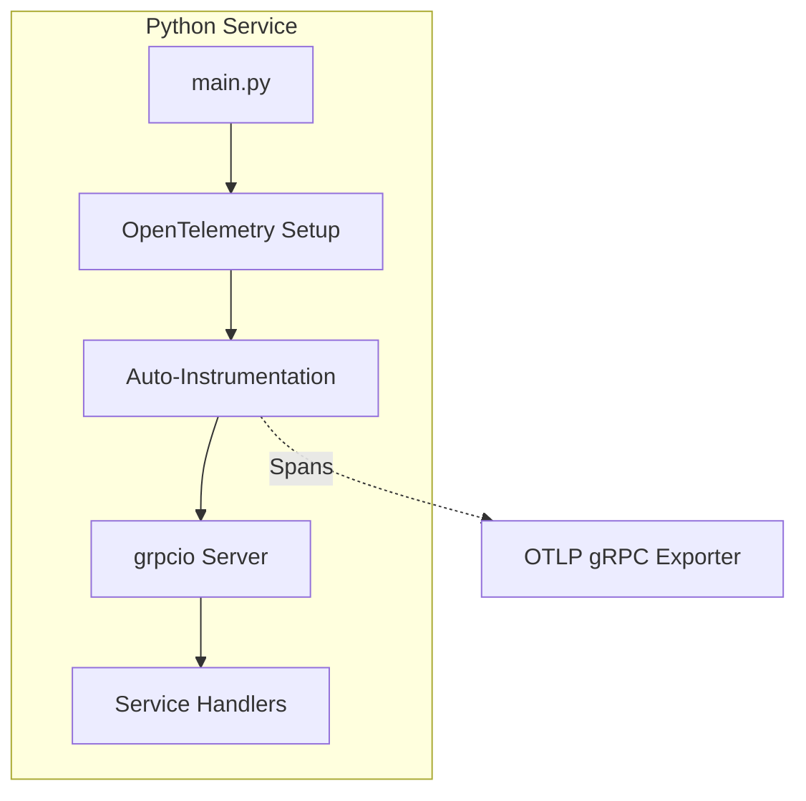

**Key Packages:**
- `opentelemetry-api`
- `opentelemetry-sdk`
- `opentelemetry-exporter-otlp-proto-grpc`
- `opentelemetry-instrumentation-grpc`

**Idiomatic Pattern:**
```python
# Automatic instrumentation
from opentelemetry.instrumentation.grpc import GrpcInstrumentorServer

GrpcInstrumentorServer().instrument()
```

### C Implementation

C requires manual instrumentation using the OpenTelemetry C++ SDK or a lightweight approach.

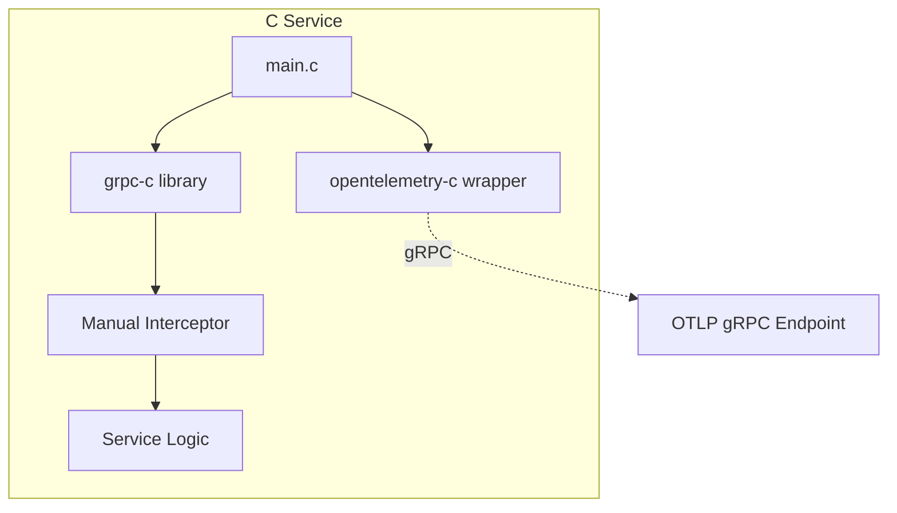

**Options:**
1. **OpenTelemetry C++ SDK** with C bindings
2. **Lightweight HTTP client** posting OTLP/JSON directly
3. **Sidecar pattern** using OpenTelemetry Collector

**Recommended: Sidecar Pattern for C Services**

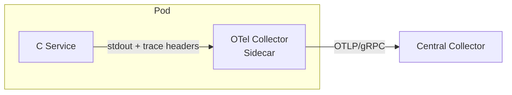

---

## Deployment Architecture

### Kubernetes Deployment

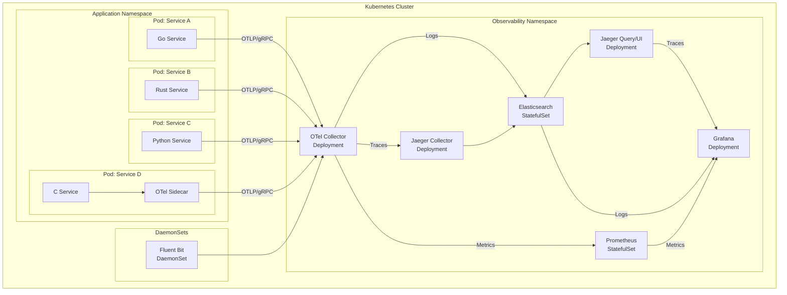

### OpenTelemetry Collector Configuration

```yaml
# otel-collector-config.yaml
receivers:
  otlp:
    protocols:
      grpc:
        endpoint: 0.0.0.0:4317
      http:
        endpoint: 0.0.0.0:4318  # Fallback for environments requiring HTTP

processors:
  batch:
    timeout: 1s
    send_batch_size: 1024
  memory_limiter:
    check_interval: 1s
    limit_mib: 1000

exporters:
  jaeger:
    endpoint: jaeger-collector:14250  # Jaeger stores traces in Elasticsearch
    tls:
      insecure: true
  prometheus:
    endpoint: 0.0.0.0:8889
  elasticsearch:
    endpoints: ["http://elasticsearch:9200"]
    logs_index: logs-otel  # Shared Elasticsearch cluster with Jaeger traces

service:
  pipelines:
    traces:
      receivers: [otlp]
      processors: [memory_limiter, batch]
      exporters: [jaeger]
    metrics:
      receivers: [otlp]
      processors: [memory_limiter, batch]
      exporters: [prometheus]
    logs:
      receivers: [otlp]
      processors: [memory_limiter, batch]
      exporters: [elasticsearch]
```

---

## Alternative Designs Considered

### Alternative 1: Jaeger Agent Sidecar Pattern

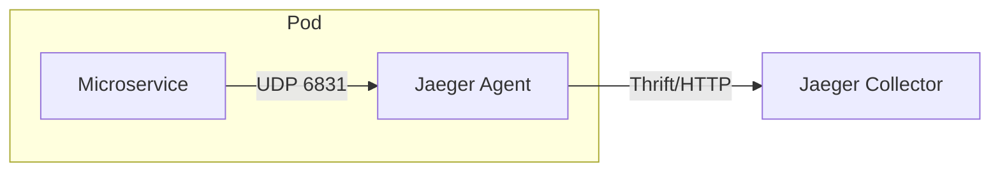

**Pros:**
- Low latency (UDP)
- Minimal service impact on failure

**Cons:**
- Jaeger-specific, not vendor-neutral
- UDP can lose traces under load
- Additional sidecar per pod

**Decision:** Rejected in favor of OpenTelemetry for vendor neutrality and future flexibility.

---

### Alternative 2: Zipkin with B3 Propagation

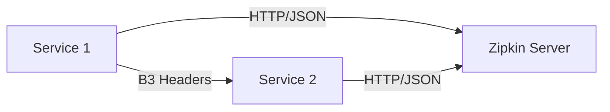

**Pros:**
- Simple, well-understood
- Good library support

**Cons:**
- B3 headers being deprecated for W3C Trace Context
- Less feature-rich than OpenTelemetry
- Single-vendor solution

**Decision:** Rejected. W3C Trace Context is the industry standard.

---

### Alternative 3: AWS X-Ray / Google Cloud Trace

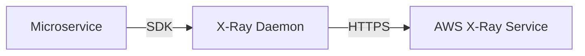

**Pros:**
- Managed service, no infrastructure
- Deep cloud integration

**Cons:**
- Vendor lock-in
- Limited multi-cloud support
- Less control over data

**Decision:** Rejected for vendor neutrality. OpenTelemetry can export to these services if needed.

---

### Alternative 4: Prometheus Pull Model for All Telemetry

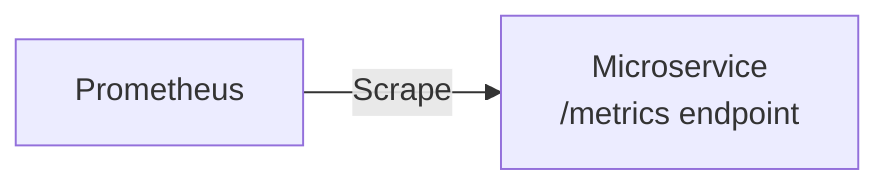

**Pros:**
- Simple, proven at scale
- No push infrastructure needed

**Cons:**
- Pull model doesn't work for traces
- Requires service discovery
- Not suitable for short-lived processes

**Decision:** Use pull model for metrics only (via OTel Collector's Prometheus exporter), push model for traces and logs.

---

### Alternative 5: Grafana Tempo Instead of Jaeger

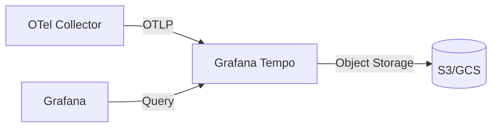

**Pros:**
- Better Grafana integration
- Cost-effective object storage backend
- Simpler operations

**Cons:**
- Younger project than Jaeger
- Fewer query capabilities

**Decision:** Both are valid. Tempo recommended for Grafana-centric stacks; Jaeger for standalone deployments. Architecture supports either.

---

### Comparison Matrix

| Criteria | OpenTelemetry + Jaeger | Jaeger Agent | Zipkin | Cloud Native | Tempo |
|----------|----------------------|--------------|--------|--------------|-------|
| Vendor Neutral | ✅ | ❌ | ⚠️ | ❌ | ✅ |
| Multi-language | ✅ | ✅ | ✅ | ⚠️ | ✅ |
| W3C Context | ✅ | ✅ | ❌ | ⚠️ | ✅ |
| Unified Metrics/Traces | ✅ | ❌ | ❌ | ⚠️ | ✅ |
| Operational Complexity | Medium | High | Low | Low | Low |
| Future-proof | ✅ | ⚠️ | ❌ | ⚠️ | ✅ |

---

## Security Considerations

### Telemetry Data Security

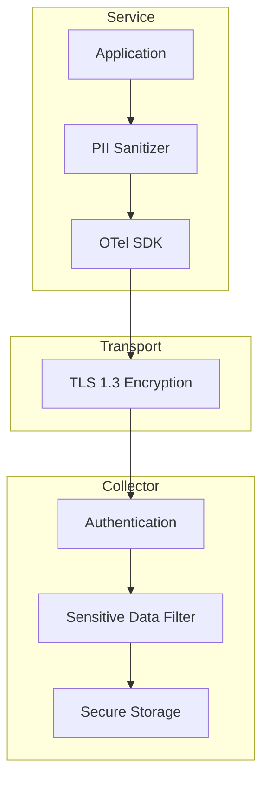

### Security Checklist

- [ ] **TLS Encryption**: All OTLP/gRPC traffic encrypted with TLS 1.3
- [ ] **Authentication**: mTLS or API keys for collector endpoints
- [ ] **PII Filtering**: Sanitize sensitive data before export
- [ ] **Access Control**: RBAC for Grafana dashboards
- [ ] **Data Retention**: Configure retention policies
- [ ] **Network Segmentation**: Observability stack in separate namespace

---

## Implementation Roadmap

### Phase 1: Foundation (Weeks 1-2)
1. Deploy OpenTelemetry Collector
2. Deploy Jaeger, Prometheus, Grafana
3. Configure collector pipelines

### Phase 2: Go Services (Weeks 3-4)
1. Add OpenTelemetry SDK to Go services
2. Configure gRPC interceptors
3. Verify trace propagation

### Phase 3: Rust Services (Weeks 5-6)
1. Integrate `tracing` with OpenTelemetry
2. Configure Tonic middleware
3. Test cross-language trace correlation

### Phase 4: Python Services (Weeks 7-8)
1. Add auto-instrumentation
2. Configure custom spans for ML workloads
3. Validate metrics export

### Phase 5: C Services (Weeks 9-10)
1. Deploy sidecar collectors
2. Implement trace header propagation
3. Configure structured logging

### Phase 6: Dashboards & Alerts (Weeks 11-12)
1. Create Grafana dashboards
2. Configure alerting rules
3. Document runbooks

---

## Appendix A: Quick Reference

### Environment Variables (Standard)

```bash
# Common across all languages
OTEL_SERVICE_NAME=my-service
OTEL_EXPORTER_OTLP_ENDPOINT=http://otel-collector:4317
OTEL_EXPORTER_OTLP_PROTOCOL=grpc
OTEL_TRACES_SAMPLER=parentbased_traceidratio
OTEL_TRACES_SAMPLER_ARG=0.1
OTEL_RESOURCE_ATTRIBUTES=service.version=1.0.0,deployment.environment=production
```

### Trace Context Headers

```
# W3C Trace Context (required)
traceparent: 00-{trace-id}-{span-id}-{flags}

# W3C Baggage (optional, for custom context)
baggage: userId=12345,requestId=abc
```

---

## Appendix B: Monitoring the Monitoring

### OTel Collector Health

```yaml
# Prometheus alerts for collector health
groups:
  - name: otel-collector
    rules:
      - alert: OtelCollectorDown
        expr: up{job="otel-collector"} == 0
        for: 5m
      - alert: OtelCollectorHighMemory
        expr: process_resident_memory_bytes{job="otel-collector"} > 1e9
        for: 10m
      - alert: OtelCollectorDroppedSpans
        expr: rate(otelcol_processor_dropped_spans[5m]) > 0
        for: 5m
```

---

## Appendix C: Grafana Dashboard Layout

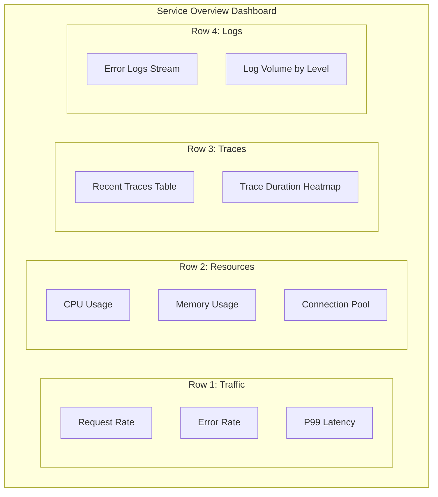

---

## Document History

| Version | Date | Author | Changes |
|---------|------|--------|---------|
| 1.0 | 2024-01-15 | Architecture Team | Initial version |
