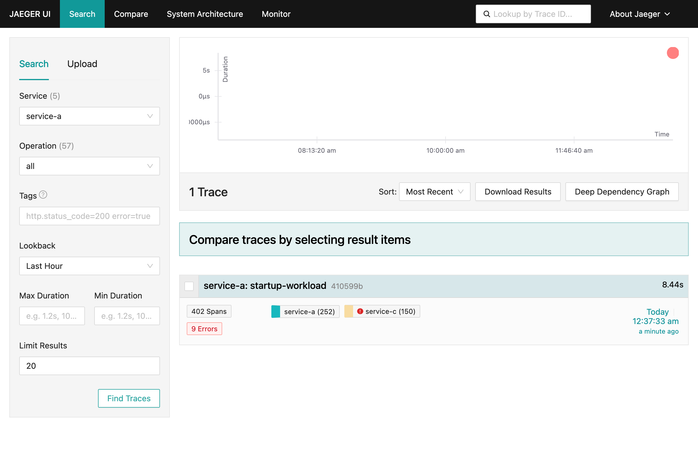
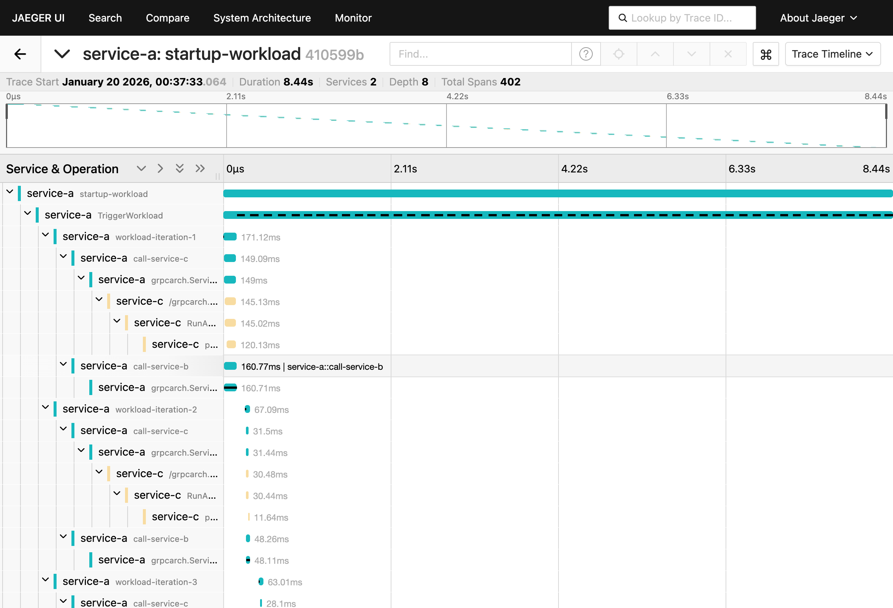
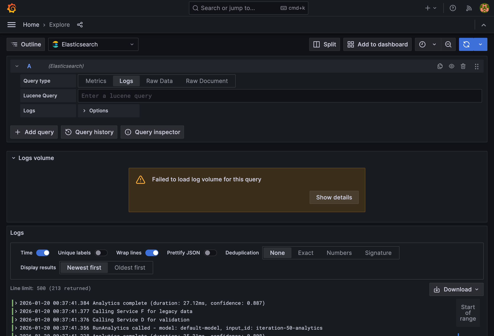
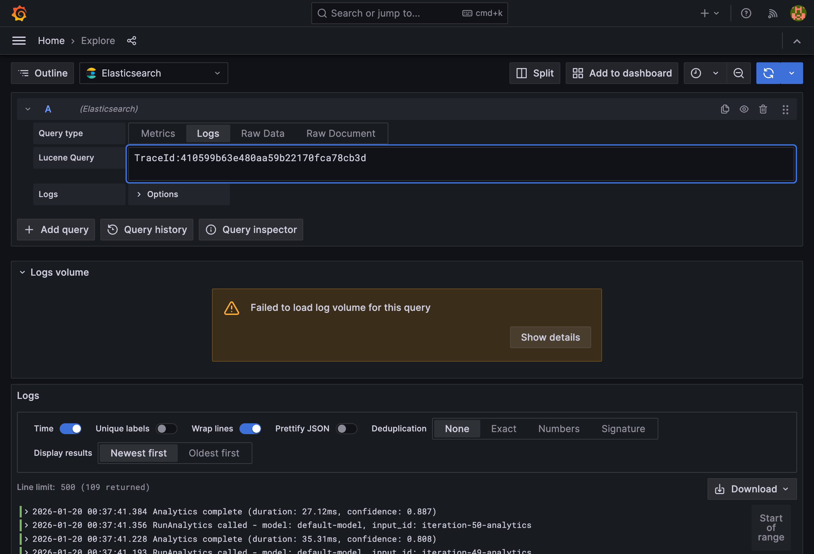
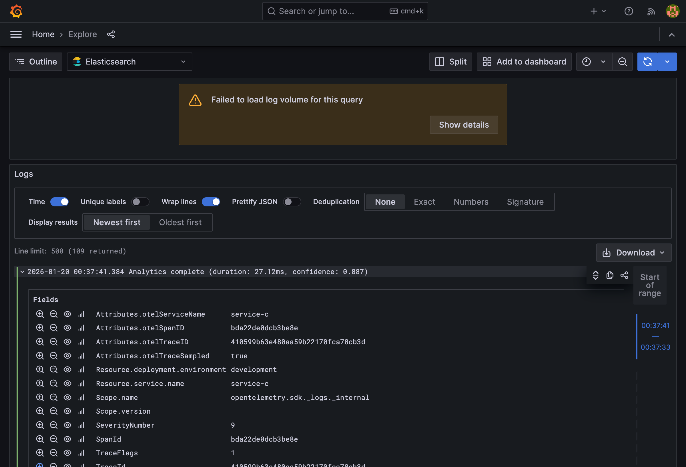

# Trace-to-Log Correlation Demonstration

This document demonstrates the trace-to-log correlation capability in the gRPC microservices observability stack. The workflow shows how to identify a distributed trace in Jaeger and then find the corresponding logs in Elasticsearch via Grafana.

## Overview

The observability stack consists of:
- **Jaeger** - Distributed tracing backend (stores traces in Elasticsearch)
- **Elasticsearch** - Storage for both traces and logs
- **OpenTelemetry Collector** - Receives telemetry from services and exports to backends
- **Grafana** - Unified UI for querying traces and logs

Services emit logs with embedded trace context (`trace_id` and `span_id`), enabling correlation between traces and logs.

---

## Step 1: Find Traces in Jaeger



**Jaeger UI Search Results**

This screenshot shows the Jaeger UI after searching for traces from `service-a`. Key observations:

- **1 Trace Found** - A single trace matching the search criteria
- **Operation**: `startup-workload` - The workload triggered on service startup
- **Trace ID**: `410599b` (full: `410599b63e480aa59b22170fca78cb3d`)
- **Duration**: 8.44 seconds
- **Span Count**: 402 spans across the distributed system
- **Errors**: 9 errors (from Service D's simulated 20% error rate)
- **Services**: service-a (252 spans), service-c (150 spans)

---

## Step 2: Examine Trace Details



**Jaeger Trace Detail View**

This screenshot shows the detailed trace timeline. Key observations:

- **Full Trace ID**: `410599b63e480aa59b22170fca78cb3d`
- **Trace Start**: January 20, 2026, 00:37:33.064
- **Total Duration**: 8.44 seconds
- **Depth**: 8 levels of nested service calls
- **Services**: 2 (service-a and service-c visible in this view)

The timeline shows:
- `service-a: startup-workload` - Root span
- `service-a: TriggerWorkload` - Main workload handler
- `service-a: workload-iteration-1` through `workload-iteration-50` - Individual iterations
- Nested calls to `service-c` and `service-b` for each iteration

---

## Step 3: View All Logs in Grafana



**Grafana Explore - Elasticsearch Logs (Unfiltered)**

This screenshot shows Grafana Explore with the Elasticsearch datasource in Logs mode. Key observations:

- **Query Type**: Logs
- **Datasource**: Elasticsearch
- **Results**: 213 logs returned (from Service C's OTLP log export)
- **Log Messages**: Various operations including:
  - `Analytics complete (duration: Xms, confidence: X.XXX)`
  - `Calling Service F for legacy data`
  - `Calling Service D for validation`
  - `RunAnalytics called - model: default-model, input_id: iteration-X-analytics`

These logs are from all traces in the time range, not filtered to a specific trace.

---

## Step 4: Filter Logs by Trace ID



**Grafana Explore - Logs Filtered by Trace ID**

This screenshot demonstrates trace-to-log correlation. Key observations:

- **Lucene Query**: `TraceId:410599b63e480aa59b22170fca78cb3d`
- **Results**: **109 logs** returned (filtered from 213 total)
- **Correlation**: All 109 logs belong to the same distributed trace we found in Jaeger

This filtering capability allows engineers to:
1. Find a problematic trace in Jaeger
2. Copy the trace ID
3. Query Elasticsearch to find all logs from that specific request flow

---

## Step 5: Examine Log Details with Trace Context



**Grafana Log Detail - Showing Trace Correlation Fields**

This screenshot shows an expanded log entry revealing the trace context fields. Key fields:

| Field | Value | Description |
|-------|-------|-------------|
| `Attributes.otelTraceID` | `410599b63e480aa59b22170fca78cb3d` | OpenTelemetry trace ID |
| `Attributes.otelSpanID` | `bda22de0dcb3be8e` | OpenTelemetry span ID |
| `Attributes.otelServiceName` | `service-c` | Service that emitted the log |
| `Resource.service.name` | `service-c` | Service name from resource attributes |
| `SpanId` | `bda22de0dcb3be8e` | Span ID (top-level field) |
| `TraceId` | `410599b63e480aa59b22170fca78cb3d` | Trace ID (top-level field) |
| `SeverityNumber` | `9` | Log level (INFO) |
| `Scope.name` | `opentelemetry.sdk._logs._internal` | OpenTelemetry SDK scope |

The log message: `Analytics complete (duration: 27.12ms, confidence: 0.887)`

---

## Summary

This demonstration shows the complete trace-to-log correlation workflow:

1. **Identify a trace** in Jaeger (e.g., a slow or erroring request)
2. **Copy the trace ID** from Jaeger
3. **Query Elasticsearch** in Grafana using `TraceId:<trace_id>`
4. **Analyze correlated logs** to understand what happened during that request

### Benefits

- **Root Cause Analysis**: When a trace shows errors, find the exact log messages explaining why
- **Performance Debugging**: Correlate slow spans with log output to identify bottlenecks
- **End-to-End Visibility**: See all log output across all services for a single request
- **Context Preservation**: Logs include span IDs, enabling correlation to specific operations within a trace

### Architecture

```
┌─────────────┐     ┌─────────────────────┐     ┌───────────────┐
│  Services   │────▶│  OTel Collector     │────▶│ Elasticsearch │
│ (A,B,C,D,E,F)│     │  (traces + logs)    │     │ (storage)     │
└─────────────┘     └─────────────────────┘     └───────┬───────┘
                                                        │
                    ┌─────────────────────┐            │
                    │      Grafana        │◀───────────┘
                    │  (query UI)         │
                    └─────────────────────┘
                              │
                    ┌─────────────────────┐
                    │      Jaeger         │◀── (traces via ES)
                    │  (trace UI)         │
                    └─────────────────────┘
```
